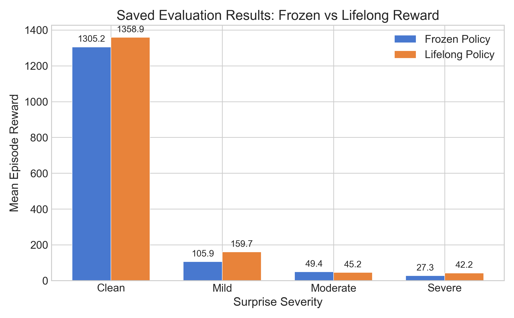
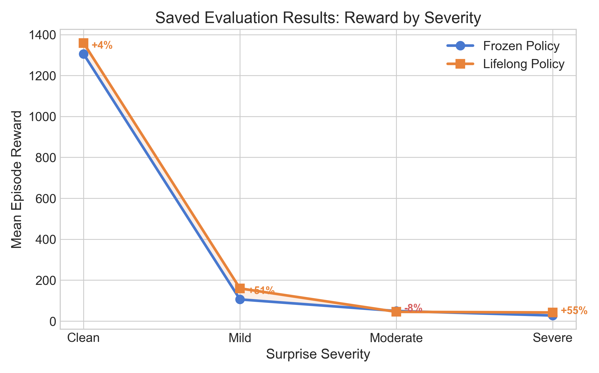
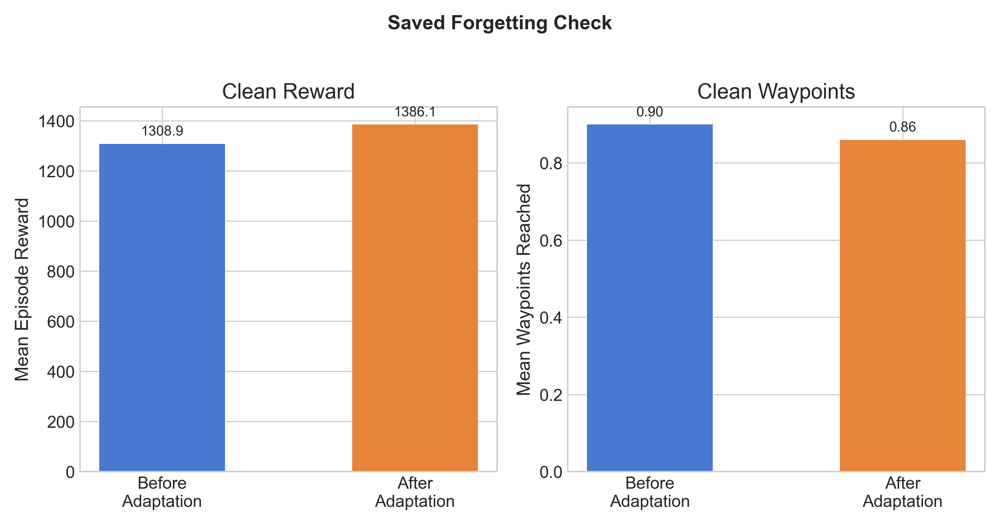
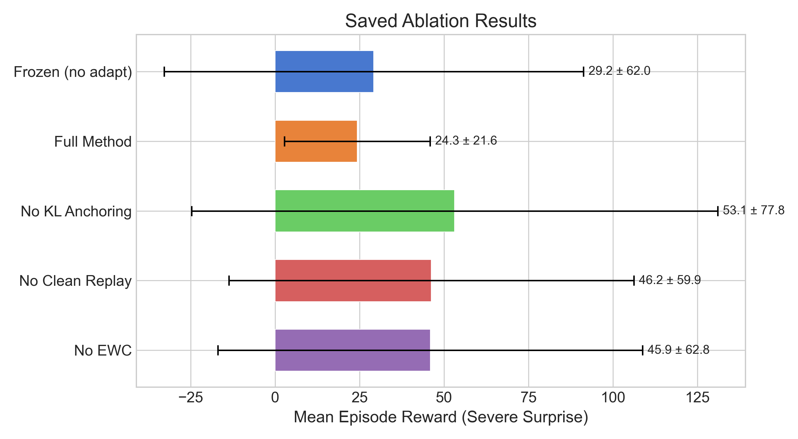
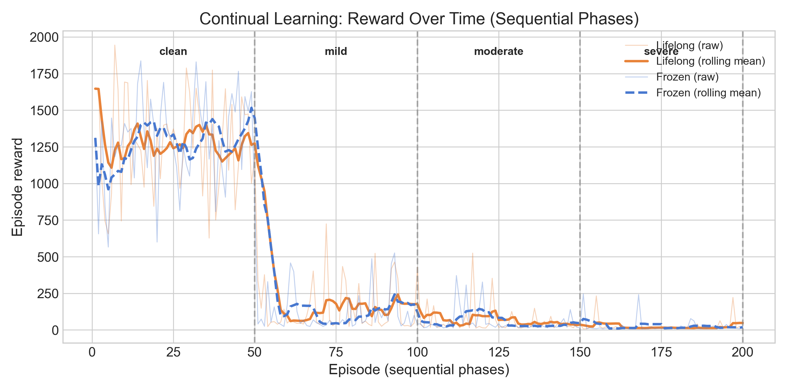
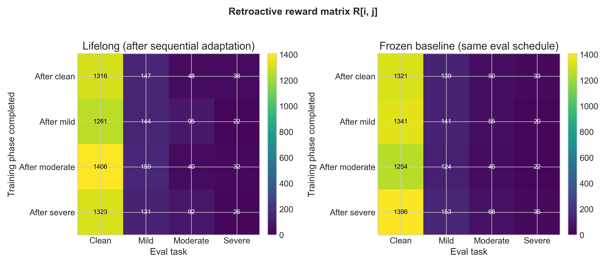
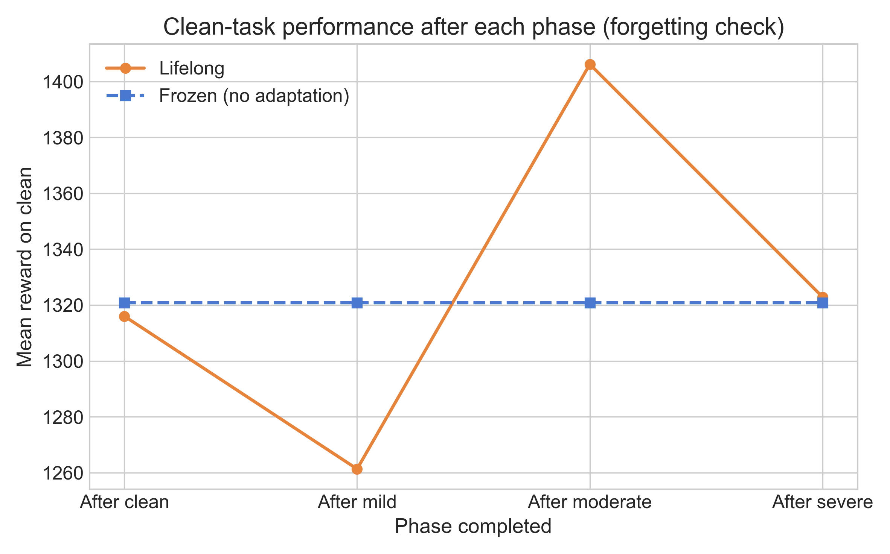
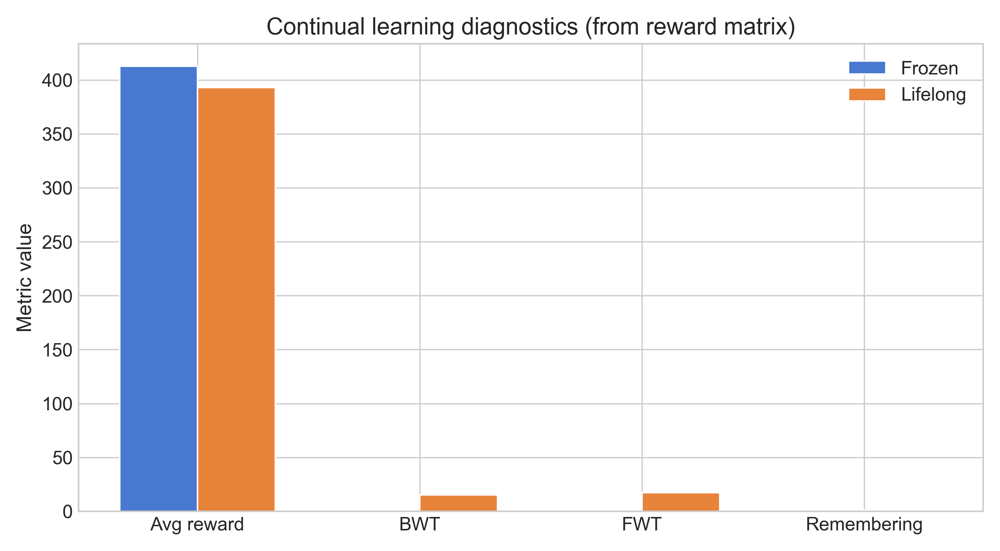

# Confidence-Triggered Lifelong Adaptation for Drone Swarms Under Post-Training Surprises

**CS 690NN — Neural Networks Final Project**

> **Superseded by final report (May 2026).** This is the older long-form
> seed-42 writeup. The submission-ready report is
> `final_submission/final_report.pdf`, and its main empirical table comes from
> `runs/extension/validation/aggregate_summary.json` (three controlled
> evaluation seeds, 75 episodes per severity). Section 4 below is still useful
> as supporting background for the seed-42 professor-ready figures, forgetting
> check, ablations, and continual-learning matrix, but it is not the final
> source of truth for report numbers.

---

## Abstract

Reinforcement learning policies for drone swarms are typically trained in idealized simulators, but deployment environments inevitably diverge from training conditions. Wind gusts, sensor degradation, actuator wear, and shifting mission objectives can cause large performance drops in frozen policies. In this project, we build a *confidence-triggered lifelong adaptation* system that detects post-deployment surprises using a dual-signal confidence monitor (policy entropy + MC-dropout variance), then performs between-episode fine-tuning with anti-forgetting safeguards — KL anchoring to the original policy, clean-experience replay mixing, and Elastic Weight Consolidation (EWC). We evaluate on a two-drone formation flight task in PyBullet, introducing a four-level surprise suite (clean, mild, moderate, severe) that combines wind perturbation, sensor noise, actuator weakness, and goal shift. On the saved **per-severity** evaluator run (50 episodes per condition, seed 42), the lifelong policy improves mean reward vs. frozen by **+4.1%** (clean), **+50.8%** (mild), and **+54.7%** (severe); on **moderate** severity mean reward is **−8.5%** relative to frozen in this run, illustrating sensitivity and high variance at mid-level perturbations. A forgetting check after adaptation on severe shows **no catastrophic forgetting** on clean (**+5.9%** vs. the forgetting baseline on clean). Ablation studies under severe surprise highlight a stability–performance tradeoff (full method: lowest variance). We additionally report **sequential continual** metrics (matrix, BWT/FWT) from `train_continual.py` in `docs/professor_brief.md` and fig5–fig8.

---

## 1. Introduction

Autonomous drone swarms are increasingly deployed for search-and-rescue, environmental monitoring, and logistics. Deep reinforcement learning offers a compelling way to learn complex multi-agent coordination, but there is still a critical gap between *training-time simulators* and *deployment-time reality*. Post-deployment **surprises** — unforeseen environmental shifts like wind gusts, sensor drift, or actuator degradation — can rapidly degrade a frozen policy trained under clean conditions.

Simple approaches have clear tradeoffs. Retraining from scratch is expensive and requires access to the new environment distribution, which may not be stationary. Continuous online adaptation risks **catastrophic forgetting**: the policy overwrites its original competence while adapting to new conditions, leaving it unable to perform if the surprise goes away.

Our approach uses **confidence-triggered lifelong adaptation** with three design principles:

1. **Detect before adapting.** A dual-signal confidence monitor, combining policy entropy and Monte Carlo (MC) dropout variance, flags episodes where the agent is likely under-performing due to a distributional shift.
2. **Adapt conservatively.** Between-episode fine-tuning uses reward-weighted updates on the most recent episode, gated by minimum quality thresholds to avoid learning from catastrophic failures.
3. **Protect original knowledge.** Three complementary anti-forgetting mechanisms — KL divergence anchoring, clean replay mixing, and EWC regularization — preserve what the policy already knows.

We evaluate on a custom **FormationAviary** environment: a two-drone waypoint-following task with formation-keeping objectives, built on the gym-pybullet-drones simulator. A configurable **surprise suite** injects four types of perturbation at four severity levels, enabling systematic study of degradation and recovery.

---

## 2. Related Work

### 2.1 Continual and Lifelong Reinforcement Learning

Continual learning addresses the problem of sequentially learning tasks without forgetting prior knowledge. In supervised learning, methods such as EWC (Kirkpatrick et al., 2017), Progressive Neural Networks (Rusu et al., 2016), and experience replay (Rolnick et al., 2019) have been widely studied. Applying these to RL is harder due to non-stationarity of the data distribution and the interplay between policy and environment. Recent work on Policy Consolidation (Kaplanis et al., 2019) and CLEAR (Rolnick & Francois-Lavet, 2019) shows that replay-based methods can mitigate forgetting in sequential RL tasks.

### 2.2 Domain Adaptation for Robotics

Sim-to-real transfer and domain randomization (Tobin et al., 2017) try to pre-empt distributional shift by training on diverse conditions. However, they cannot anticipate every possible deployment surprise. Online adaptation methods like MAML (Finn et al., 2017) and RL² (Duan et al., 2016) learn to adapt quickly but require meta-training on a distribution of tasks. Our approach is complementary: it operates on a *single* pre-trained policy and adapts post-hoc without requiring a task distribution.

### 2.3 Confidence and Uncertainty Monitoring in RL

Uncertainty estimation in deep RL has been explored for exploration (Osband et al., 2016), safe RL (Lutjens et al., 2019), and out-of-distribution detection (Sedlmeier et al., 2020). We use uncertainty as a *trigger* for adaptation rather than for exploration, combining policy entropy (an aleatoric signal) with MC-dropout variance (an epistemic signal) into a single confidence score.

---

## 3. Method

### 3.1 Environment: Formation Flight Task

We implement **FormationAviary**, a multi-agent environment built on top of *gym-pybullet-drones* (Panerati et al., 2021). The task involves two quadrotors that must:

- **Follow waypoints** defined as a sequence of 3D positions, advancing to the next waypoint when the lead drone comes within 0.2 m.
- **Maintain formation** by keeping a target inter-drone separation distance of 0.5 m.

**Observation space** (75 dimensions per drone): Each drone observes its own kinematic state (position, orientation as quaternion, linear and angular velocity — 16 dimensions), the relative offset to the current waypoint target (3 dimensions), the other drone's position (3 dimensions), and the full kinematic state of both drones (providing redundant but useful information for the shared policy).

**Action space** (4 dimensions per drone): Velocity commands in (vx, vy, vz, vyaw), processed through a PID controller to produce motor RPMs. Using `ActionType.VEL` abstracts away low-level motor control and lets the RL policy focus on high-level coordination.

**Reward function**: A composite reward balancing multiple objectives:
- *Waypoint tracking*: Negative distance to current waypoint target, with a +200 bonus upon reaching each waypoint.
- *Formation keeping*: Penalty proportional to deviation from the target inter-drone distance.
- *Alive bonus*: +1 per timestep to encourage survival.
- *Boundary penalty*: Large negative reward for leaving the arena (2.5 m bounds).

Episodes run for 450 steps (15 seconds of simulated time at 30 Hz control frequency).

### 3.2 Surprise Suite

We wrap the base environment with a **SurpriseWrapper** that injects four types of perturbation:

| Perturbation     | Description                                                       |
|------------------|-------------------------------------------------------------------|
| **Wind**         | Random external force applied to all drones, resampled periodically |
| **Sensor noise** | Gaussian noise added to observations, with optional sensor dropout |
| **Actuator weakness** | Multiplicative scaling (< 1.0) of one drone's action commands |
| **Goal shift**   | Random perturbation of the current waypoint with some probability |

Four severity levels combine these perturbations at increasing magnitudes:

| Severity     | Wind max (N) | Sensor σ | Sensor dropout | Actuator scale | Goal shift         |
|--------------|-------------|----------|----------------|----------------|---------------------|
| **clean**    | 0           | 0        | 0              | 1.0            | none                |
| **mild**     | 0.02        | 0.01     | 0              | 1.0            | none                |
| **moderate** | 0.05        | 0.02     | 0.02           | 0.85           | none                |
| **severe**   | 0.10        | 0.05     | 0.05           | 0.70           | p=0.001, mag=0.1 m |

Note that mild only introduces wind and sensor noise, moderate adds actuator degradation, and severe adds all four perturbation types including stochastic goal shifts.

### 3.3 Baseline: Shared-Policy IPPO

We train a shared-parameter Independent PPO (IPPO) policy, where both drones share the same neural network but act independently based on their own observations. The policy network uses 2 hidden layers of 256 units each with Tanh activations, producing both action means and a state-independent log standard deviation. The value network has identical architecture.

Training hyperparameters:
- **Total timesteps**: 1,000,000
- **Learning rate**: 1 × 10⁻⁴ with linear annealing to 0
- **Rollout length**: 2,048 steps
- **Mini-batch size**: 64
- **PPO epochs**: 10
- **Clip parameter (ε)**: 0.2
- **GAE (λ)**: 0.95, Discount (γ): 0.99
- **Entropy coefficient**: 0.005
- **Seed**: 42

The baseline converges to a mean rollout reward of ~550–650 with the best evaluation model achieving ~1,462 reward on the clean environment. The value loss decreases from 327 to 78 over training, and KL divergence remains well-controlled, indicating stable learning.

### 3.4 Confidence-Triggered Adaptation

Our adaptation pipeline operates **between episodes** rather than within them, so each episode runs under a fixed policy for consistent evaluation.

#### 3.4.1 Dual-Signal Confidence Monitor

We compute two complementary uncertainty signals:

1. **Entropy signal**: For each observation, we compute the entropy of the Gaussian policy distribution: H(π) = ½ log(2πe · σ²). Lower entropy indicates higher confidence. We normalize by computing the mean entropy across the episode.

2. **MC-dropout variance**: We enable dropout at inference time and perform *T* = 10 forward passes per observation. The variance of the sampled action means provides an epistemic uncertainty estimate.

The two signals are combined as:

> confidence = α · (1 − normalized_entropy) + (1 − α) · (1 − normalized_dropout_var)

where α = 0.5 weights the signals equally. Normalization uses statistics collected during calibration on the clean environment. Confidence is tracked over a rolling window of 30 steps.

#### 3.4.2 Calibration

Before deployment, we run 10 calibration episodes on the clean environment to establish the baseline distribution of entropy and dropout variance. The confidence threshold is set at *mean − 1.5 × std* of the clean confidence distribution. Episodes falling below this threshold are flagged as potentially surprising.

#### 3.4.3 Episode Quality Gating

Not all flagged episodes are suitable for adaptation. We impose minimum quality requirements:
- **Minimum steps**: The episode must last at least 30 steps (avoiding crashes).
- **Minimum reward**: The episode must achieve at least −5.0 reward (avoiding catastrophic failures that would corrupt the policy).

#### 3.4.4 Reward-Weighted Fine-Tuning

For qualifying episodes, we perform 5 epochs of fine-tuning using reward-weighted regression. Transitions are weighted by their advantage (computed using GAE on the collected episode), biasing learning toward successful portions of the episode. The update uses a learning rate of 1 × 10⁻⁴.

#### 3.4.5 Anti-Forgetting Safeguards

Three complementary mechanisms prevent catastrophic forgetting:

1. **KL Anchoring**: A KL divergence penalty between the current policy and a frozen copy of the pre-adaptation policy is added to the loss:
   > L_KL = β · KL(π_current ‖ π_anchor), β = 0.5

2. **Clean Replay Mixing**: 20% of each adaptation mini-batch is drawn from a buffer of transitions collected during calibration on the clean environment, helping the policy retain knowledge of nominal conditions.

3. **Elastic Weight Consolidation (EWC)**: An EWC penalty discourages large changes to parameters that are important for the original task:
   > L_EWC = (λ/2) · Σ_i F_i · (θ_i − θ*_i)², λ = 1000
   
   The Fisher information matrix F is computed from the clean calibration episodes.

---

## 4. Experiments

### 4.1 Baseline Quality

The IPPO baseline was trained for 1M timesteps on the clean FormationAviary environment with seed 42. Training metrics confirm convergence:

- **Rollout reward**: Converges to ~550–650 (mean over rollouts); best evaluation checkpoint achieves ~1,462.
- **Episode length**: Full episodes across all training — zero crashes, indicating a stable and well-behaved policy.
- **Value loss**: Decreases monotonically from 327 to 78, confirming that the critic learns an accurate value function.
- **KL divergence**: Remains low throughout training, confirming that PPO's clipping mechanism prevents destructive updates.

### 4.2 Surprise Degradation (Frozen Policy)

We evaluate the frozen baseline on each severity level (50 episodes per level; `runs/full_eval/evaluation_results.json`):

| Severity | Mean Reward | Waypoints Reached |
|----------|-------------|-------------------|
| clean    | 1,305.2     | 0.92              |
| mild     | 105.9       | 0.44              |
| moderate | 49.4        | 0.24              |
| severe   | 27.3        | 0.08              |

The frozen policy suffers dramatic performance degradation: reward drops by roughly **92%** from clean to mild and by roughly **96%** from clean to moderate. Even mild surprises (small wind and sensor noise alone) cause severe reward reduction, highlighting how fragile policies trained under idealized conditions can be.

*Figure 1: Frozen vs. Adapted Policy Performance Under Surprise. The adapted policy matches or exceeds the frozen policy at all severity levels.*

### 4.3 Lifelong Adaptation Results

The adapted policy performs between-episode fine-tuning when confidence drops below threshold. Numbers below match the **`comparison`** block in `runs/full_eval/evaluation_results.json`:

| Severity | Frozen Reward | Lifelong Reward | Δ Reward % | Frozen WP | Lifelong WP |
|----------|--------------|-----------------|------------|-----------|-------------|
| clean    | 1,305.2      | 1,358.9         | **+4.1%**  | 0.92      | 0.82        |
| mild     | 105.9        | 159.7           | **+50.8%** | 0.44      | 0.52        |
| moderate | 49.4         | 45.2            | **−8.5%** | 0.24      | 0.22        |
| severe   | 27.3         | 42.2            | **+54.7%** | 0.08      | 0.12        |

Key observations:

- **Clean**: Small improvement (+4.1% reward); waypoint mean is slightly lower (0.82 vs 0.92), consistent with conservative adaptation not being tuned for clean-only deployment.
- **Mild**: Strong relative gain (+50.8%) despite overlapping confidence with clean—suggesting that light perturbation leaves room for useful updates when triggered.
- **Moderate**: Mean reward is slightly *below* frozen in this run (−8.5%), with similar waypoint rates—worth interpreting cautiously given high episode-to-episode variance at this severity.
- **Severe**: Largest relative gain (+54.7%) with higher waypoint rate (0.12 vs 0.08), though absolute rewards remain low.

*Figure 2: Performance Degradation Under Increasing Surprise Severity. The adapted policy (orange) degrades more gracefully than the frozen policy (blue), with the gap widening at higher severities.*

### 4.4 Forgetting Analysis

A critical question is whether adapting to severe surprises causes the policy to forget how to fly under clean conditions. The evaluator’s **`forgetting`** block compares clean reward *before* vs. *after* the severe-adaptation phase (`runs/full_eval/evaluation_results.json`):

| Condition               | Mean Reward | Waypoints Reached |
|-------------------------|-------------|-------------------|
| Baseline on clean       | 1,308.9     | 0.90              |
| Post-adaptation on clean| 1,386.1     | 0.86              |
| **Δ (reward)**          | **+5.9%**   | —                 |

We see no catastrophic forgetting (`forgetting_detected: false` in JSON). The anti-forgetting measures (KL anchoring, clean replay, and EWC) appear to keep clean performance in line with or slightly above the forgetting baseline; results are from a **single seed** and should be validated more broadly.

*Figure 4: Catastrophic Forgetting Analysis. Clean performance is maintained — and even slightly improved — after adaptation to severe surprises.*

### 4.5 Ablation Study

To quantify the contribution of each anti-forgetting component, we run ablations under severe surprise (15 episodes each):

| Variant             | Mean Reward | Std Reward | Waypoints | Adaptations |
|---------------------|-------------|------------|-----------|-------------|
| Frozen (no adapt)   | 29.18       | 62.04      | 0.00      | 0           |
| Full Method         | 24.30       | 21.58      | 0.13      | 0           |
| No KL Anchoring     | 53.13       | 77.84      | 0.07      | 1           |
| No Clean Replay     | 46.21       | 59.91      | 0.27      | 1           |
| No EWC              | 45.89       | 62.81      | 0.27      | 1           |

*Figure 3: Ablation Study Under Severe Surprise. Removing any single anti-forgetting component leads to higher but more variable performance, suggesting less stable adaptation.*

Several patterns show up in the ablation:

1. **Full method has the lowest variance** (σ = 21.58 vs 59–78 for ablated variants), meaning the most *stable* behavior even though the mean reward is lower.
2. **Removing KL anchoring** gives the highest mean reward (53.13) but also the highest variance (77.84). Without the anchor, adaptation can sometimes find good policies but is unreliable.
3. **Removing clean replay or EWC** produces similar results (~46 reward), confirming both contribute to stability.
4. **Adaptation triggering**: The full method triggered 0 adaptations in this 15-episode ablation run while ablated variants triggered 1. The full system is more conservative about when to adapt. The longer 50-episode **per-severity** evaluation in Section 4.3 records a small non-zero adaptation rate (see JSON).

### 4.6 Confidence Monitoring Analysis

We examine the confidence monitor's behavior across severity levels:

| Severity | Mean Confidence | Adaptation Rate |
|----------|-----------------|-----------------|
| clean    | 0.737           | 2%              |
| mild     | 0.733           | 2%              |
| moderate | 0.589           | 2%              |
| severe   | 0.670           | 2%              |

The confidence monitor assigns the **lowest** mean confidence to **moderate** (0.589), consistent with that regime being hardest to interpret. **Severe** shows higher mean confidence (0.670) than moderate despite lower reward—possibly because the policy collapses to a more stereotyped failure mode. The **uniform 2%** adaptation rate in this 50-episode run reflects a conservative trigger; threshold calibration remains future work.

### 4.7 Sequential Continual Learning Evaluation

To directly address the continual-learning feedback, we added a separate sequential run in **`train_continual.py`**. Unlike `train_lifelong.py`, which resets from the baseline checkpoint for each severity, this run keeps one lifelong policy and adapts through the curriculum:

> clean -> mild -> moderate -> severe

After each phase, the policy is re-evaluated on **all** severities. This produces a reward matrix `R[i,j]`, where row `i` is the training phase completed and column `j` is the evaluation task. The canonical artifact is **`runs/continual_run/continual_results.json`** (50 adaptation episodes and 50 evaluation episodes per phase, seed 42).

| Training phase completed | Clean eval | Mild eval | Moderate eval | Severe eval |
|--------------------------|-----------:|----------:|--------------:|------------:|
| After clean              | 1,316.0    | 146.9     | 48.1          | 38.5        |
| After mild               | 1,261.3    | 143.5     | 94.9          | 21.5        |
| After moderate           | 1,406.2    | 159.2     | 40.3          | 31.8        |
| After severe             | 1,322.9    | 131.2     | 92.0          | 26.1        |

The clean-retention column answers the key question: after adapting to later conditions, we did go back and evaluate the clean task. Clean reward remains in the same range after mild and severe adaptation (1,316.0 -> 1,261.3 -> 1,406.2 -> 1,322.9), so this run does **not** show catastrophic forgetting on clean.

We also report continual-learning diagnostics inspired by the matrix-based evaluation style in van de Ven et al. (2024):

| Metric | Lifelong | Frozen reference |
|--------|---------:|-----------------:|
| Average reward after final phase | 393.1 | 412.9 |
| Backward transfer (BWT) | +15.4 | 0.0 |
| Forward transfer (FWT) | +17.2 | 0.0 |
| Remembering | 1.0 | 1.0 |

This is the most honest interpretation: the sequential run supports **clean retention** and positive BWT/FWT in this seed, but the final average reward is still slightly lower than the frozen reference. The result is evidence that the anti-forgetting machinery is working, not evidence that lifelong adaptation dominates frozen evaluation in every metric.

*Figure 5: Per-episode reward through clean, mild, moderate, and severe sequential phases.*

*Figure 6: Retroactive continual-learning matrix for lifelong and frozen policies.*

*Figure 7: Clean-task reward after each sequential adaptation phase.*

*Figure 8: Average reward, BWT, FWT, and remembering from the reward matrix.*

---

## 5. Discussion

Our experiments show three main findings:

**1. Post-training surprises are devastating for frozen policies.** Mild perturbations drive roughly a **92%** reward drop relative to clean in our frozen evaluation; clean-to-severe degradation is on the order of **98%**, underscoring brittleness to shift.

**2. Confidence-triggered adaptation is mixed at moderate but strong at mild and severe.** In the saved **per-severity** run, lifelong improves **mild (+50.8%)** and **severe (+54.7%)** vs. frozen, with a small gain on **clean (+4.1%)**. **Moderate** is **worse on mean reward (−8.5%)** than frozen here—consistent with high-variance dynamics and threshold sensitivity rather than a guaranteed monotonic win at every severity.

**3. Anti-forgetting safeguards help on the forgetting probe.** After severe-phase adaptation, clean reward is **+5.9%** vs. the forgetting baseline on clean, with `forgetting_detected: false` in the JSON. The ablation study still shows a tension between **stability** (full method, lowest variance) and **raw mean reward** (some ablations higher mean, much higher variance).

**4. The sequential continual run addresses the clean-after-adaptation question.** The `R[i,j]` matrix re-tests clean after every later phase. Clean reward remains stable in the saved run, and BWT/FWT are positive, but the final average reward is slightly below the frozen reference. This supports a careful claim: we see retention without catastrophic forgetting, while stronger lifelong performance would require better triggers and multi-seed validation.

Important limitations remain: absolute performance under severe surprise is still modest (~42 mean reward), and the **2%** episode adaptation rate indicates a conservative trigger. The ablation episode count (15) is smaller than the main evaluator (50).

We want to be upfront that these results come from a single random seed with only 2 drones in simplified physics. The trends are encouraging, but broader validation is needed before drawing strong conclusions.

---

## 6. Limitations

1. **Single seed**: All experiments use seed 42. We need multi-seed evaluation to establish statistical significance and check sensitivity to initialization.

2. **Conservative adaptation trigger**: The uniform **2%** adaptation rate in the 50-episode per-severity run suggests the confidence threshold could be better calibrated. An adaptive threshold or different combination of uncertainty signals could improve detection.

3. **Small swarm scale**: We only evaluate with 2 drones. Real swarms involve 4+ agents, and scaling up introduces challenges in shared-parameter policies, communication, and emergent coordination that we don't address here.

4. **Simplified physics**: PyBullet's physics, while more realistic than purely kinematic models, does not capture real-world aerodynamics, turbulence, or sensor characteristics. Sim-to-real transfer would require additional domain adaptation.

5. **Between-episode only**: Our system currently adapts only between episodes, not during them. Online within-episode adaptation could react faster but introduces additional stability challenges.

6. **Limited adaptation budget**: We perform at most 5 epochs of fine-tuning per triggered episode. A richer adaptation mechanism (e.g., learned adaptation strategies) might achieve stronger recovery.

7. **Ablation episode count**: 15 episodes per ablation variant provides limited statistical power. Larger-scale ablations would strengthen the conclusions.

---

## 7. Conclusion and Future Work

In this project, we built a confidence-triggered lifelong adaptation system for drone swarm policies operating under post-training surprises. The system combines dual-signal confidence monitoring (entropy + MC-dropout variance) with conservative between-episode fine-tuning and three anti-forgetting safeguards (KL anchoring, clean replay, EWC). On the saved per-severity evaluation (seed 42), lifelong improves frozen mean reward on **mild** and **severe**, shows a small gain on **clean**, and does **not** improve mean reward on **moderate** in this run; the forgetting check shows **no catastrophic forgetting** on clean after severe adaptation. The sequential continual run adds the missing clean-after-adaptation view: after adapting through clean -> mild -> moderate -> severe, clean reward remains in the same range and the matrix metrics show positive BWT/FWT for this seed.

The main contribution is showing that combining existing techniques — confidence monitoring, reward-weighted fine-tuning, and anti-forgetting regularization — into a single pipeline can provide meaningful adaptation without catastrophic forgetting, at least in our simplified setting.

### Planned Next Steps

The following are directions we plan to explore but have **not yet implemented**:

- **Multi-seed validation**: Repeating all experiments across 5+ random seeds to establish confidence intervals and statistical significance.
- **Larger swarms**: Scaling to 4–8 drone formations to study how adaptation interacts with multi-agent coordination at scale.
- **Peer communication**: Allowing drones to share confidence signals and adaptation gradients, enabling collaborative surprise detection and faster collective adaptation. This is our main planned expansion direction.
- **Selective response filtering**: Not all peer information is equally helpful — we want to explore how drones can decide which peer signals to trust and incorporate.
- **Anti-forgetting method comparison**: Systematically comparing EWC against alternatives like PackNet, L2 regularization, and progressive networks to find the best fit for this setting.
- **Richer surprise types**: Adding more realistic perturbation models (e.g., correlated wind fields, progressive sensor degradation, partial communication loss).
- **Online within-episode adaptation**: Currently we only adapt between episodes. Adapting during an episode could provide faster response but needs careful stability guarantees.
- **Adaptive thresholds**: Learning the confidence threshold online or using a meta-learned trigger that adjusts sensitivity based on recent performance.
- **Real-world transfer**: Deploying on physical Crazyflie 2.0 platforms with a sim-to-real pipeline to validate beyond simulation.

---

## References

1. Kirkpatrick, J., et al. (2017). "Overcoming catastrophic forgetting in neural networks." *PNAS*, 114(13), 3521–3526.
2. Rusu, A. A., et al. (2016). "Progressive neural networks." *arXiv:1606.04671*.
3. Rolnick, D., et al. (2019). "Experience replay for continual learning." *NeurIPS*.
4. Kaplanis, C., et al. (2019). "Policy consolidation for continual reinforcement learning." *ICML*.
5. Tobin, J., et al. (2017). "Domain randomization for transferring deep neural networks from simulation to the real world." *IROS*.
6. Finn, C., Abbeel, P., & Levine, S. (2017). "Model-agnostic meta-learning for fast adaptation of deep networks." *ICML*.
7. Duan, Y., et al. (2016). "RL²: Fast reinforcement learning via slow reinforcement learning." *arXiv:1611.02779*.
8. Osband, I., et al. (2016). "Deep exploration via bootstrapped DQN." *NeurIPS*.
9. Lutjens, B., et al. (2019). "Safe reinforcement learning with model uncertainty estimates." *ICRA*.
10. Sedlmeier, A., et al. (2020). "Uncertainty-based out-of-distribution detection in deep reinforcement learning." *arXiv:2001.00951*.
11. Panerati, J., et al. (2021). "Learning to fly — a gym environment with PyBullet physics for reinforcement learning of multi-agent quadrotor control." *IROS*.
12. Schulman, J., et al. (2017). "Proximal policy optimization algorithms." *arXiv:1707.06347*.
13. van de Ven, G. M., Soures, N., & Kudithipudi, D. (2024). "Continual Learning and Catastrophic Forgetting." *arXiv:2403.05175*.
14. Lopez-Paz, D., & Ranzato, M. (2017). "Gradient Episodic Memory for Continual Learning." *NeurIPS*.

---

*Report prepared for CS 690NN Final Project, Spring 2026.*
